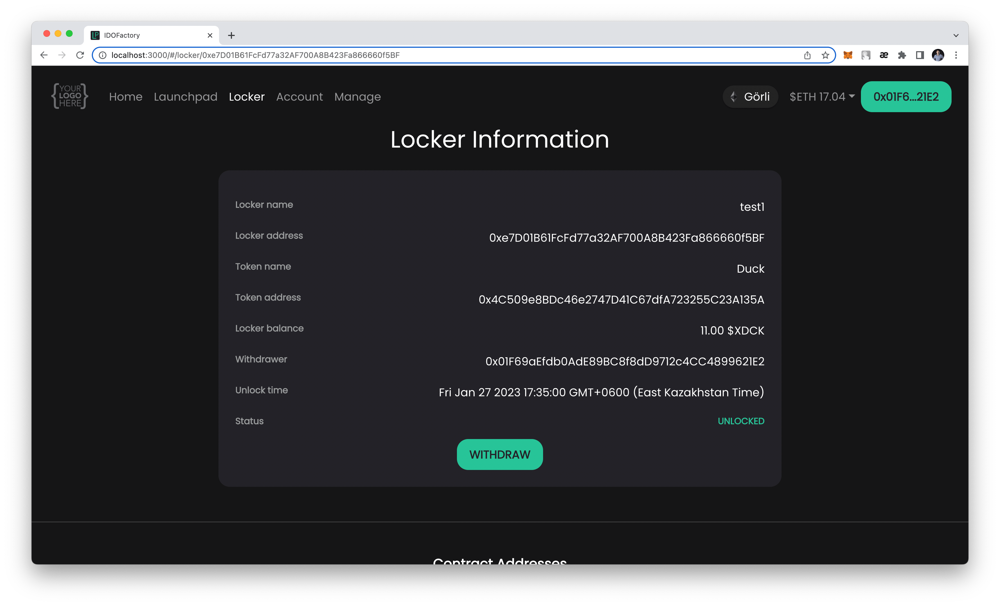
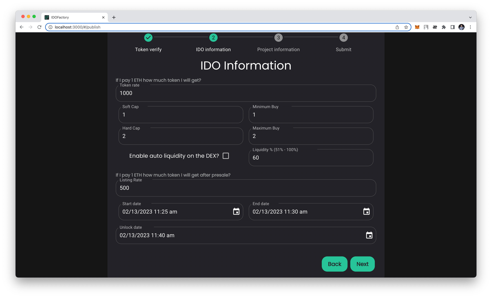
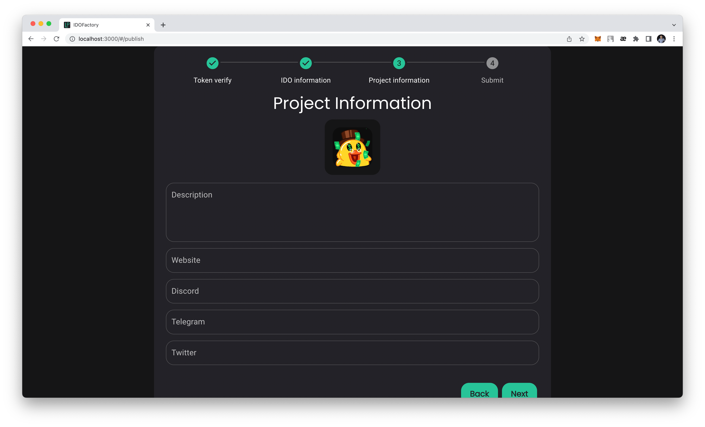

# IDOFactory

White-label Decentralized IDO Launchpad Platform

## Installation

1. Install dependencies

    ```bash
    yarn
    ```

2. Start app

    ```bash
    yarn start
    ```

Open [http://localhost:3000](http://localhost:3000) with your browser to see the result.

## Launch and Setting Up Application

1. Set owner
    
2. Manage IPFS:
    
3. Manage network:
   
  * BSC test net:
  + RPC: https://data-seed-prebsc-1-s2.binance.org:8545
  + IDO Graph URL: https://api.studio.thegraph.com/query/48288/bsc-testnet-ido-factory/version/latest
  + Locker Graph URL: https://api.studio.thegraph.com/query/48288/locker-bsc-testnet/version/latest
  * Goerli test net:
  + RPC: https://rpc.ankr.com/eth_goerli
  + IDO Graph URL https://api.studio.thegraph.com/query/48674/ido-factory-goerli/version/latest
  + Locker Graph URL: https://api.studio.thegraph.com/query/48288/my-locker-factory/version/latest
4. Manage contract:
  
  * BSC test net:
  + Fee Token Address: 0xaD337556Adfa1a1DE33DEedB5Af27Cb99D6A954d
  + IDO Factory Address: 0x6FE13010f5D3f847539c1b6b4705006a47335718
  + Locker Factory Address: 0x2f91CC6529f91152999Aba81cdE0CaA98Ca3Ed65
  * Goerli test net:
  + Fee Token Address: 0x5197B8D0937375e828AE4A11a35d982594153797
  + IDO Factory Address: 0x515AD0745AF9BEE8B82D039314e5a50088F01e19
  + Locker Factory Address: 0x6268Ad78C5eD1E1cab8B51341639c20a78f4EDe9

## Add a new EVM-like chain

[Read](./docs/addNewNetwork.md)

## Images

1. Home page
    
1. Launchpad page
    
1. IDO info pages
    
    
1. Locker page
    
1. Locker info page
    
1. Account page
    
1. Create Launchpad Pool pages
    
    
    
    
    
1. Lock Token page
    
